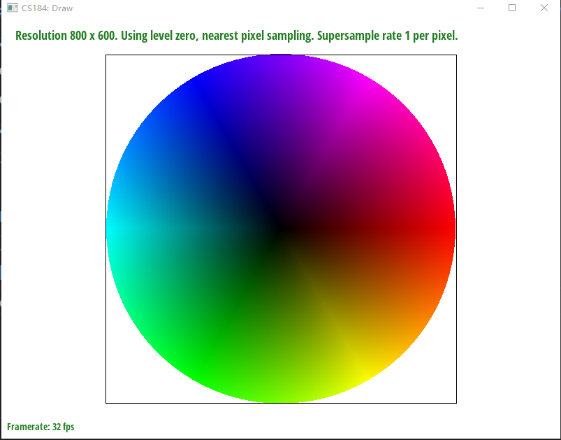

# CS 184 Project 1

**IE9 OR ABOVE AND JAVASCRIPT CAPABILITY IS REQUIRED TO SUCCESSFULLY RENDER THIS DOCUMENT**  
**HTML5 IS PREFERABLE BUT NOT REQUIRED**

This site best viewed with Netscape Navigator: 

## Overview
In this project, a simple rasterizer is made. Overall, four main topics which we learnt are involved and used: point-in-triangle test (for task 1 and task 2), homogeneous coordinate systems and transformations within (task 3), and barycentric coordinates (for task 4, 5, 6), and texture filtering/mipmap (for task 5, 6).  
Overall, in all tasks expect task 3 (which is mainly linear algebra), we do two things: determine if a point in buffer, which depends on supersampling rate, should be drawed, and if it is to be drawn, determine what colour it should be.

## Task 1

### Walk through how you rasterize triangles in your own words
My task 1 mainly consists the following steps:
1. Find the maximum and minimum of x and y coordinates, and chop-off out-of-boundary parts if needed. This determines the bounding box.
2. Construct 3 line functions as lambda functions, one for x0-x1, one for x1-x2, one for x2-x0 (order matters). This is inefficient, but it drastically increases readibility.
3. Loop through every x and y coordinate in the bounding box, and check if `(x + 0.5f, y + 0.5f)` is on the same side (all positive or all negative) of all three lines - we do not need to care about orientation if we use this test.
4. If they are, call `fill_pixel(x, y, color)` to update buffer.

### Explain how your algorithm is no worse than one that checks each sample within the bounding box of the triangle
My algorithm is checking each sample within the bounding box of the triangle, so it cannot be worse.

### Show a png screenshot of `basic/test4.svg`

  
Hopefully this part is interesting!

### Extra Credit
A lot of modifications are made, they are available in `q1-ec` branch.  
0. Instead of declaring lambda function, I inlined all point-in-line expressions. This makes calculations significantly quicker as no function calls are involved.
1. Instead of calculating `x = xx + 0.5f` and *vice versa* for `y`, I initialise `x` and `y` and add `1.0f` each time. This is good because int<->float arithmetics is slow.  
2. I outer-loop `x` and inner-loop `y`. In inner loop, if I encountered pixels inside the traingle, and then found one pixel that is outside of the triangle, break the inner-loop as nothing beyond is to be rendered. This is useful for triangles like the green one in `test-4`.
3. I record the `y` values when rendering the first and second verticle (`x`) line. Then for each new `x` value, I pre-calculate which `y` it should start scanning from. This is useful for triangles like the magenta one in `test-4`.
With 2 and 3 combined, the "bounding box" should look like this:   

I used `std::chrono::steady_clock` to measure preformance before and after optimisations.

|Test|No optimisation|All optimisations|
|---|---|---|
|test-4.svg (triangle 0)|1166900|900900|
|test-4.svg (triangle 1)|596600|390300|
|test-4.svg (triangle 2)|213300|171200|
|test-4.svg (triangle 3)|1104700|860700|
|test-4.svg (triangle 4)|73900|58300|
|05_lion.svg (all)|50414300|40105500|

## Task 2
### Walk through your supersampling algorithm and data structures
The only data structure I used is `std::vector<Color>` named `sample_buffer` which is also included in skeleton. I made its size `sample_rate` times bigger than pixels contained in the graph.  
The algorithm is very simple. Scale everything (`width`, `height`, `x0`, `y0`, ...) by $\sqrt{\text{sample\_rate}}$ (which is guaranteed to be an integer), then write to the sample buffer as if there's no supersampling at all. Finally, in `resolve_to_framebuffer`, for frame buffer position `x, y`, look for all sample buffer position with $x+x'$ where $x'=\{0, 1, ..., \sqrt{\text{sample\_rate}}\}$ and *vice versa* for $y+y'$, a total of $\text{sample\_rate}$ samples. Average them out to obtain the real colour, and finally write to corresponding frame buffer.

### Why is supersampling useful
It antialiases by making sampling frequency higher, thus make Shannon-Nyquist frequency higher, and make HF parts finer.

### What modifications did you make to the rasterization pipeline in the process
1. `resolve_to_framebuffer` is modified as described above.
2. A new method, `fill_supersampled_pixel`, is declared and does exactly the same thing as original `fill_pixel`.
3. The original `fill_pixel` now fills all $\text{sample\_rate}$ samples in the sample buffer which the coordinate corresponds to.
4. Every function that wants to use supersampling must use `fill_supersampled_pixel` with supersampled coordinate. Functions that do not supersample needs no modification as they continue to use `fill_pixel`.
5. Every time a change in samping rate is detected, the sample buffer must be reset and everything re-drawed.

### Show png screenshots
  
  
  
  
These effects are observed because more samples are done at sharper edges (HF parts), resulting in finer edges.

### Extra Credit
TBD

## Task 3
  
This is a picture of a decapitated cubeman (instead of a robot, this is Robespierre!) who is still waving. I used `translate` on its head and `translate` with `rotate` on its right arm.   
 

### Extra Credit
I added a feature to rotate the camera when pressing `Q` and `E` in branch `q3-ec`.  
<video width="1024" height="768" controls>
  <source src="images/rotate.mp4" type="video/mp4">
Your browser does not support the video tag.
</video> 
You can use [this link](https://github.com/cal-cs184-student/sp22-project-webpages-axmmisaka/raw/master/proj1/images/rotate.mp4) to download if you are running Netscape 3.0.

## Task 4
### Explain barycentric coordinates in your own words
Barycentric coordinates is basically representing how a point in a triangle's relative position/relative distance to each vertex is. We can then see how much "influence" each vertex can give to that point, or map two triangles given 3 vertices between one and another.  
  
In this example, points to the right are relatively closer to the rightmost vertex (coloured red), and thus they are "influenced" by red more and are mostly coloured red.

### Screenshot

## Task 5
### Explain pixel sampling in your own words...
Basically, given three coordinates in `uv` plane, determine which point in texture space a barycentric coordinate which we calculated from a point in triangle in screen space corresponds to, and get the colour we need from the texture.  
My implementation is to first get barycentric coordinates, then multiply them with $u_0, u_1, u_2$ and $v_0, v_1, v_2$ accordingly. This should get us the corresponding texture space coordinate.  
Then we need pixel sampling method to get the actual colour. For nearest sampling, I round both `u` and `v` to nearest integer, and then sample colour from texture. For bilinear sampling, I first check if `u` and `v` are integer, and decide if I should directly sample the point or use linear sampling. If they are not, I round up and down `u` and `v`, get colour from `u, v`'s four nearest neighbours, then interpolate them with `lerp()` function to obtain the colour for `u, v`.
 
### Check out the svg...
Nearest at 1:
  
Bilinear at 1:
  
Nearest at 16:
  
Bilinear at 16:
  

## Task 6
### Explain level sampling...
Essentially, we calculate the norm of "stretch" vector ($\frac{\partial (u, v)}{\partial x}$ or *vice versa*, in other words, how much difference are there in texture space when there's 1 unit of difference in screen space), and choose the best mipmap level that minimises aliasing given the "stretch". I simply calculated $\frac{\partial (u, v)}{\partial x}$ and $\frac{\partial (u, v)}{\partial y}$ as instructed in the spec (`rasterizer.cpp:227-241`), and used them to calculate $L$ as shown [here](https://cs184.eecs.berkeley.edu/sp22/lecture/5-65/texture-mapping).

### You can now adjust your sampling...
I will be like aPple and use "fastest", "faster" and "fast", but in reality they mean "fast", "medium" and "slow".

|By...|Selecting Pixel Sampling|Level Sampling|Number of Samples per Pixel (Supersampling)|  
|--|--|--|--|  
|Speed|Fastest (no additional ops)|Faster (need calculate $L$ and access `std::vector`)|Fast (need to sample much more pixels and downsample)|
|Memory Usage|Smallest (no additional memory cost)|Small/Smaller (need to store mipmap in memory, may be ideal if there's few textures and big sample buffer)|Small/Smaller (need to store a much bigger sample buffer, may be ideal if there's a lot of textures)|
|Antialiasing power|High (only antialiasing is to take off your glasses)|Higher (transition between mipmaps and other issues)|Highest (directly change Shannon-Nyquist frequency)|

### Using a png file you find yourself
Pic:   

|Level\Pixel|Nearest|Bilinear|
---|---|---|
Zero|||
Nearest|||
Linear|||

[svg file](images/test7-diana.svg)

## Extra Credit Crevitivity
"Execution of Louis XVI"  
  
  

### Explain how you did it
I made it with Adobe Illustrator. Illustrator will use `<rect> ` instead of `<polygon>` for rectangles when generating svg files. `robot.svg` bypassed this by using two triangles to form a rectangle. I bypassed this by adding a new anchor point for each rectangle, so Illustrator thought it's actually a pentagon.