# Report on CS 184 Project 2: Mesh Edit

Visit this webpage here: https://cal-cs184-student.github.io/sp22-project-webpages-axmmisaka/proj2/index.html
And here: https://cal-cs184-student.github.io/sp22-project-webpages-YijunLi-FiM/render.html?src=proj2/index.md

**IE9 OR ABOVE AND JAVASCRIPT CAPABILITY IS REQUIRED TO SUCCESSFULLY RENDER THIS DOCUMENT**  
**HTML5 IS PREFERABLE BUT NOT REQUIRED**

## Overview

This project explores typical methods of geometric modeling, namely Bezier Curves/Surfaces and Half Edge data structure that's commonly used to construct mesh. 

## Task 1: Bezier Curves with 1D de Casteljau's Subdivision
- Briefly explain de Casteljau's algorithm and how you implemented it in order to evaluate Bezier curves.   
  A Bezier curve of degree $n$ is defined by $(n+1)$ control points. The de Casteljau method is used to construct the actual curve with provided control points and parameter $t\in[0,1]$. To elaborate, de Casteljau method iteratively performs linear interpolation between each neighboring control points to get $(n-1)$ intermediate control points from $n$, then rinse and repeat, until we get the final point which is on the actual curve. In task 1, `BezierCurve::evaluateStep` only execute a single step of de Casteljau method, and was called iteratively to get the final point on curve. Scanning through enough values of $t\in[0,1]$, the output points can form a good approximation of Bezier curve. 
- Show screenshots of each step / level of the evaluation from the original control points down to the final evaluated point.   

|        Initial       |        Level 1       |        Level 2       |       Level 3        |
|----------------------|----------------------|----------------------|----------------------|
|  | 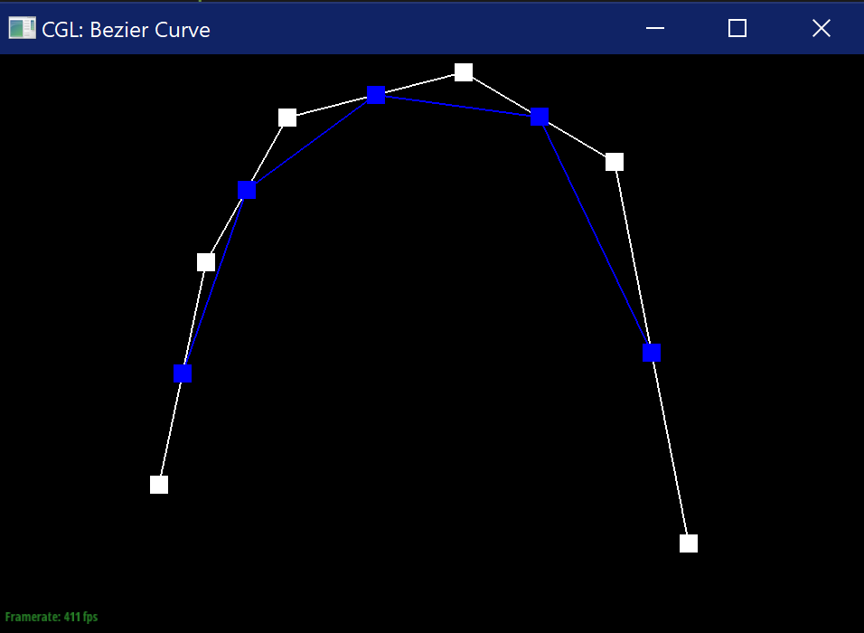 | 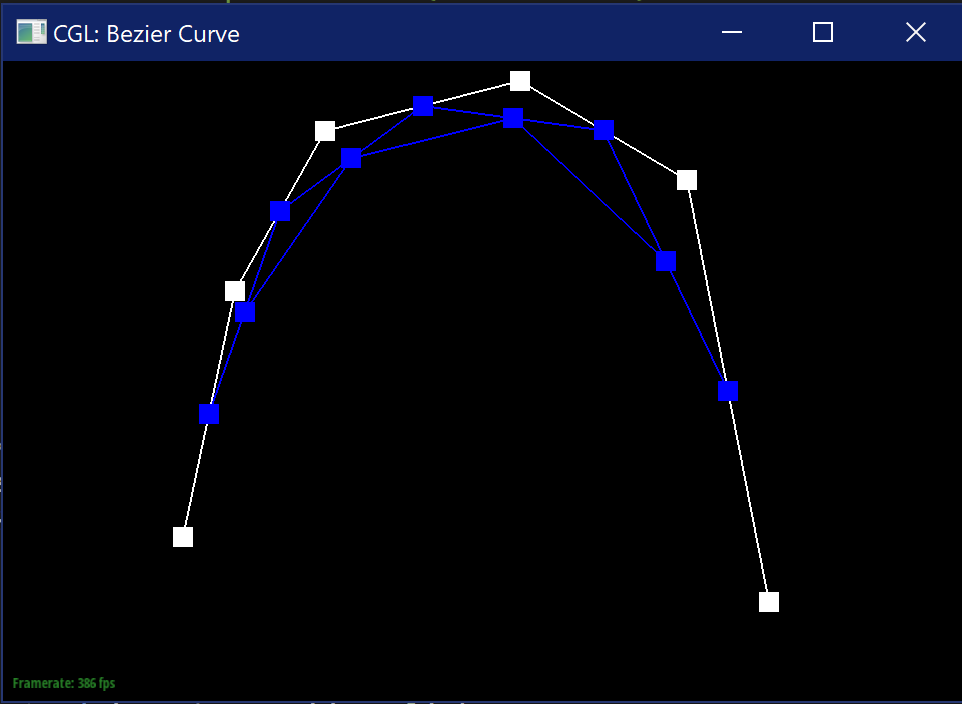 | 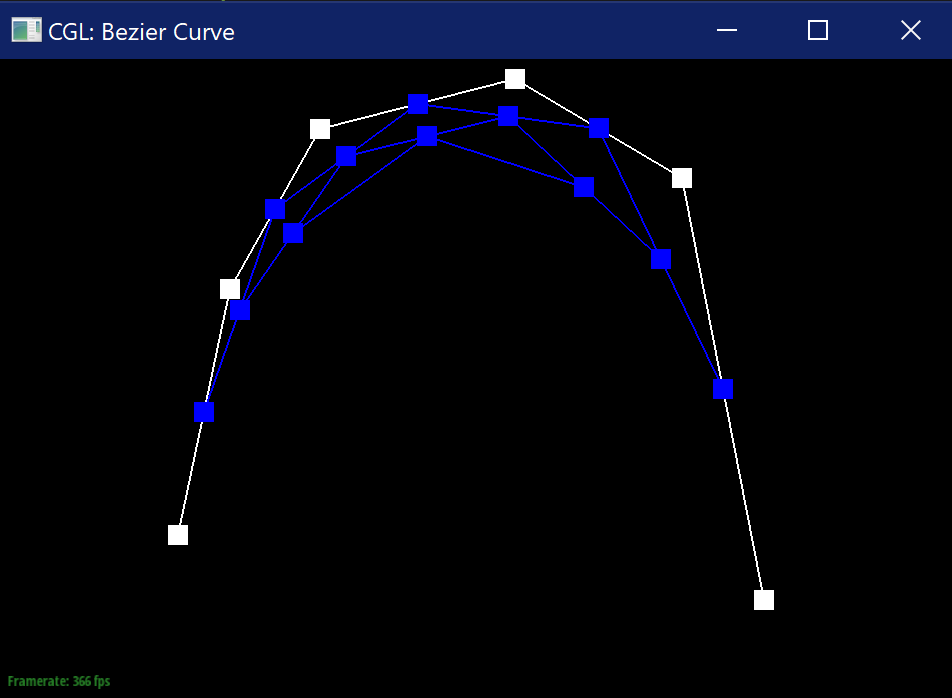 |
|        Level 4       |      Final Point     |        Curve         |                      |
| 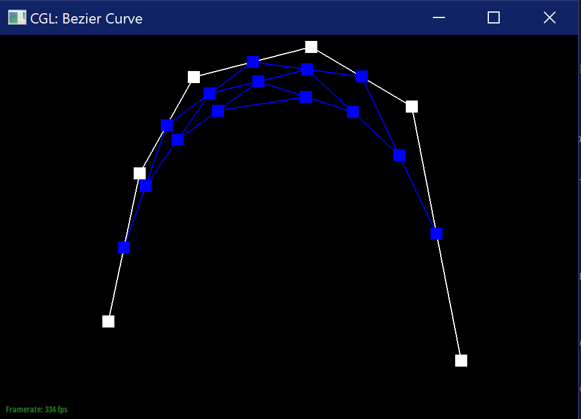 |  | 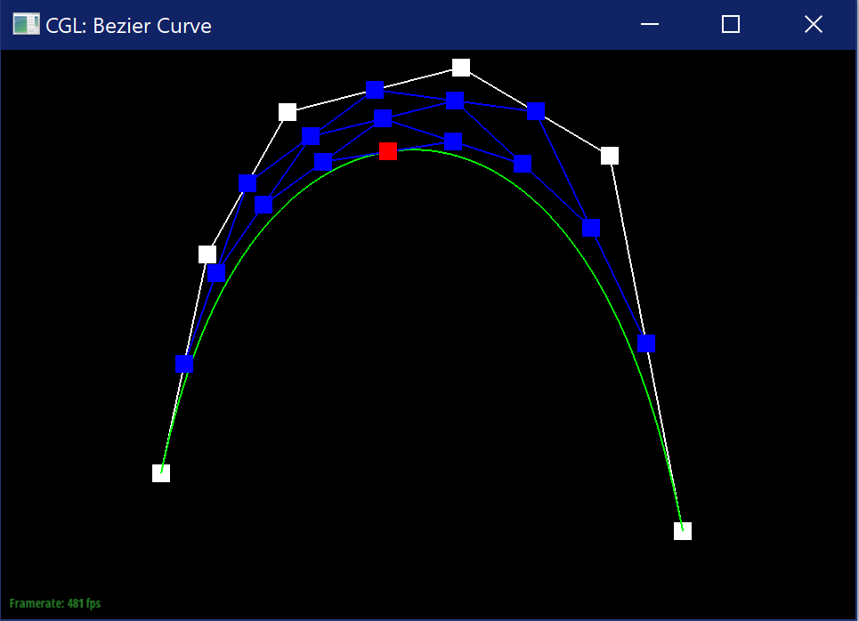 |                      |
- Show a screenshot of a slightly different Bezier curve by moving the original control points around and modifying the parameter t via mouse scrolling.   

|        Initial        |        Level 1        |        Level 2        |        Level 3        |
|-----------------------|-----------------------|-----------------------|-----------------------|
| 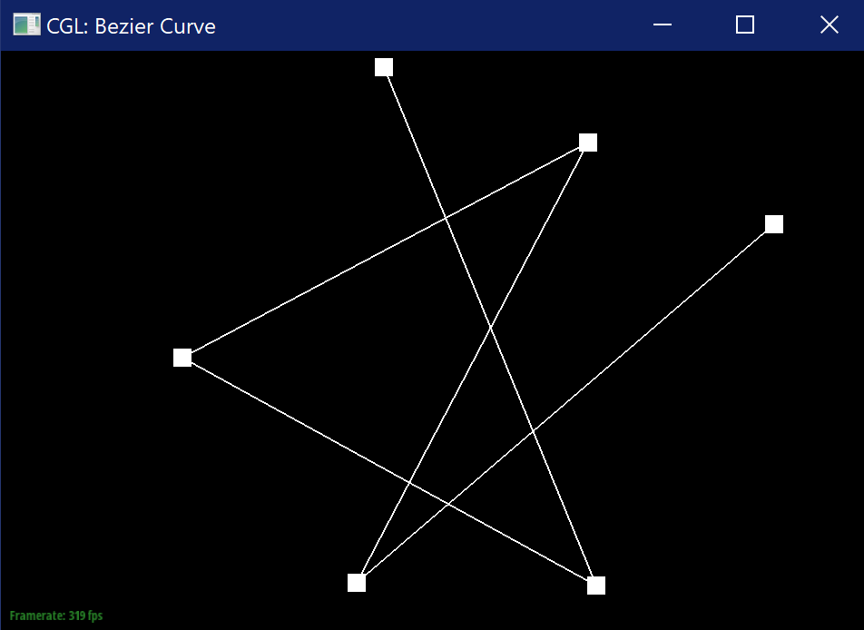  |   |  | 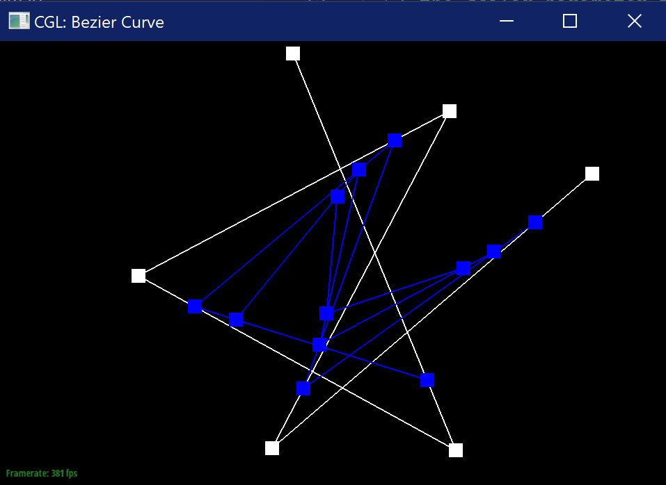 |
|        Level 4        |      Final Point      |         Curve         |                       |
| 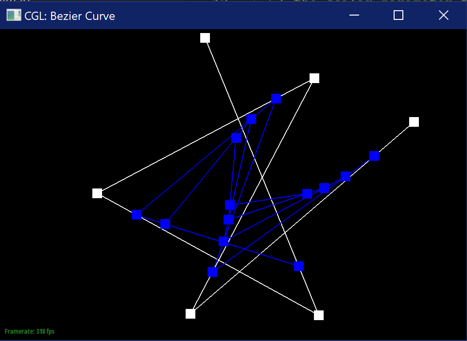 | 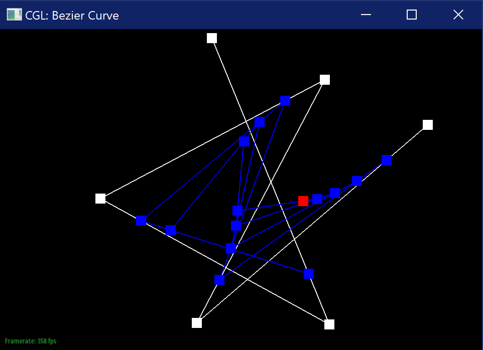 |  |                       |

## Task 2: Bezier Surfaces with Separable 1D de Casteljau's Subdivision
- Briefly explain how de Casteljau algorithm extends to Bezier surfaces and how you implemented it in order to evaluate Bezier surfaces.   
  Using de Casteljau's method on 1D Bezier curve also applies to the calculation of 3D Bezier surfaces, albeit with some extra steps. The first step is to use 1D de Casteljau to generate Bezier curves for each row of control point (in this case, using `BezierPatch::evaluate1D`). Then we parametrized those curves with $u\in[0,1]$ and obtain intermediate control points on each curve, which can be used in `BezierPatch::evaluate1D` with parameter $v$ again to get a new curve that lies on the actual surface. 
- Show a screenshot of `bez/teapot.bez` (not .dae) evaluated by your implementation.   
  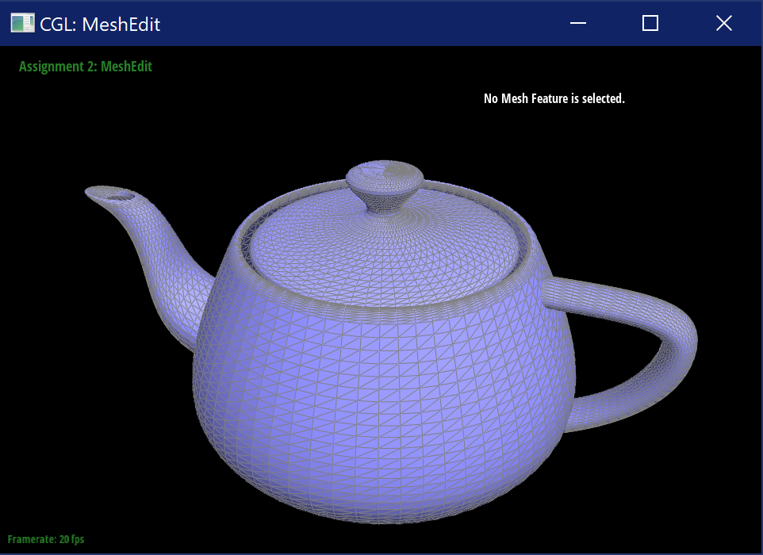

## Task 3: Area-Weighted Vertex Normals
- Briefly explain how you implemented the area-weighted vertex normals.   
  Starting from a halfedge with current vertex as starting point, we iterate through every halfedge adjacent to current vertex with `h->twin()->next()` and accumulate the unit normal vector of its corresponding face with `h->face()->normal()`. The average of those normal vectors is the final result. 
- Show screenshots of `dae/teapot.dae` (not .bez) comparing teapot shading with and without vertex normals.   
  Without vertex normals:   
     
  With vertex normals:   
  

## Task 4: Edge Flip
- Briefly explain how you implemented the edge flip operation and describe any interesting implementation / debugging tricks you have used.  
First, I explicitly get iterators to all elements with naming convention in this picture:   
  
Then, reassign halfedge of edges/vertices/faces and updated next/twin/vertex/face/edge of halfedges. Finally return `e0`. Simple and stupid.

- Show screenshots of the teapot before and after some edge flips.   
  Before:   
     
  After:   
     
- Write about your eventful debugging journey, if you have experienced one.  
The whole process is bugless, I became paranoid when I saw some edges disappearing, it appears that it's actually overlap.

## Task 5: Edge Split
- Briefly explain how you implemented the edge split operation and describe any interesting implementation / debugging tricks you have used.   
Similar to task 4, I drew a graph to make sure I do not brainf**k myself when naming elements.  
  
First, I explicitly get iterators to all elements with naming convention in this picture.  
Second, I create new elements, namely `m`, `h10-15`, `e5-7`, `f2-3`. Set `e5` and `e6` `isNew` to be `true` for the purpose of T6. Set `m` `isNew` to be `true` for the purpose of T6.
Finally, I reassign halfedge of edges/vertices/faces and updated next/twin/vertex/face/edge of halfedges. Finally return `e0`. Simple and stupid.

- Show screenshots of a mesh before and after some edge splits.   
  Before:   
  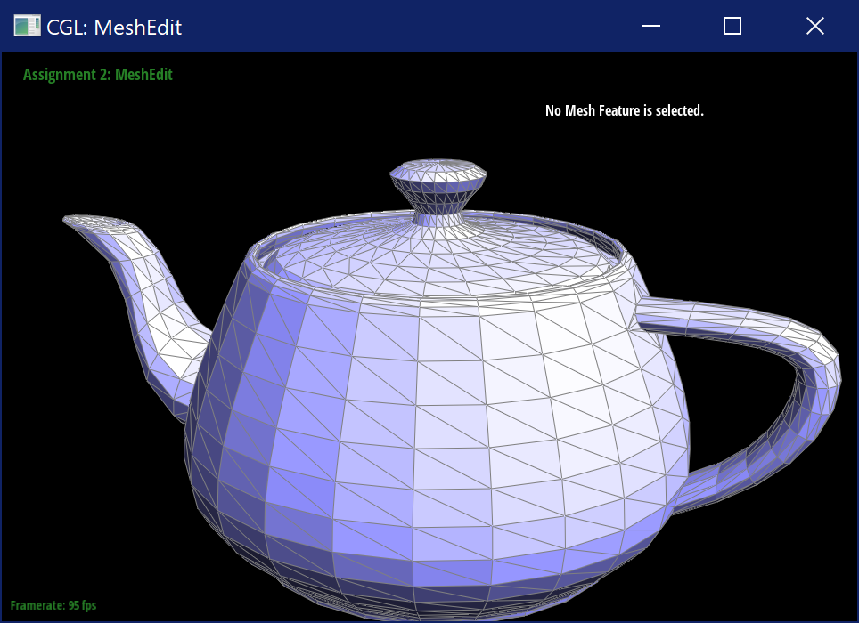   
  After:   
     
- Show screenshots of a mesh before and after a combination of both edge splits and edge flips.   
  Before:   
     
  After:   
  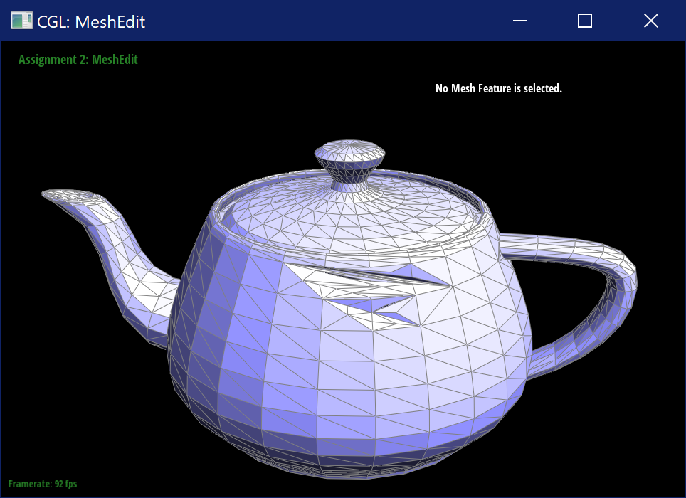   
- Write about your eventful debugging journey, if you have experienced one.   
Some half edges are not rendering correctly. I double-checked my graph and fixed some wrong vertex neighbour assignments.  
- If you have implemented support for boundary edges, show screenshots of your implementation properly handling split operations on boundary edges.   
For implementation, see branch `q5-ec`.  
  

## Task 6: Loop Subdivision for Mesh Upsampling
- Briefly explain how you implemented the loop subdivision and describe any interesting implementation / debugging tricks you have used.   
I did exactly the same thing as the comments mentioned:
1. for each existing vertex, calculate its new position based on its surronding vertices, and set its `isNew` to false;
2. for each edge, calculate the new position of the vertex which will be created from its splitting based on four vertices mentioned in the spec, and set its `isNew` to false;
3. split all edges that does not has `isNew` set AND has two non-new vertices (that is, it's not a splitted edge), and set resulting new vertex to `newPosition` of the edge calculated in (2)
4. flip all edges that has `isNew` set and has one old vertex and one new vertex (use xor to calculate)

- Take some notes, as well as some screenshots, of your observations on how meshes behave after loop subdivision. What happens to sharp corners and edges? Can you reduce this effect by pre-splitting some edges?   
Sharp corners and edges got smoother. This is `.\dae\icosahedron\input.dae`.
If we pre-split edges of sharp corners, the result becomes sharper. Similarly, if we pre-split other edges of sharp edges' faces, the result becomes sharper.  

|Splits/Position|No|Vertex|Edge|
---|---|---|---|
0||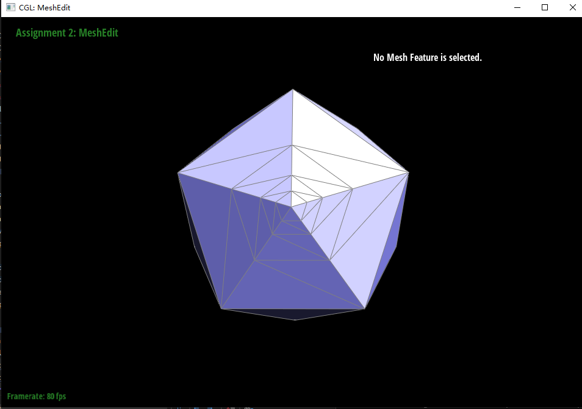||
1||||
2|||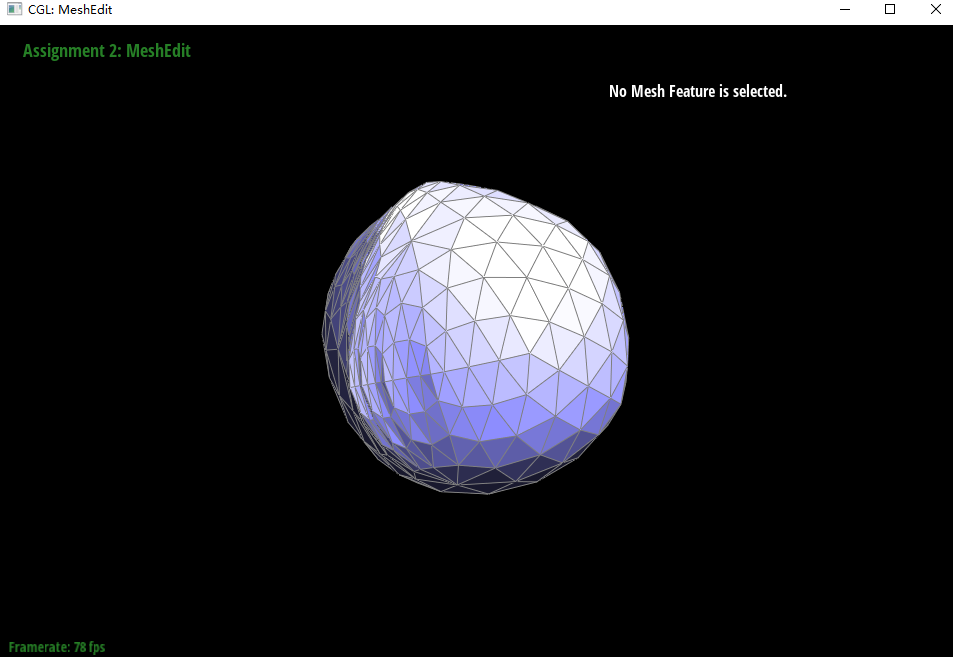|
3|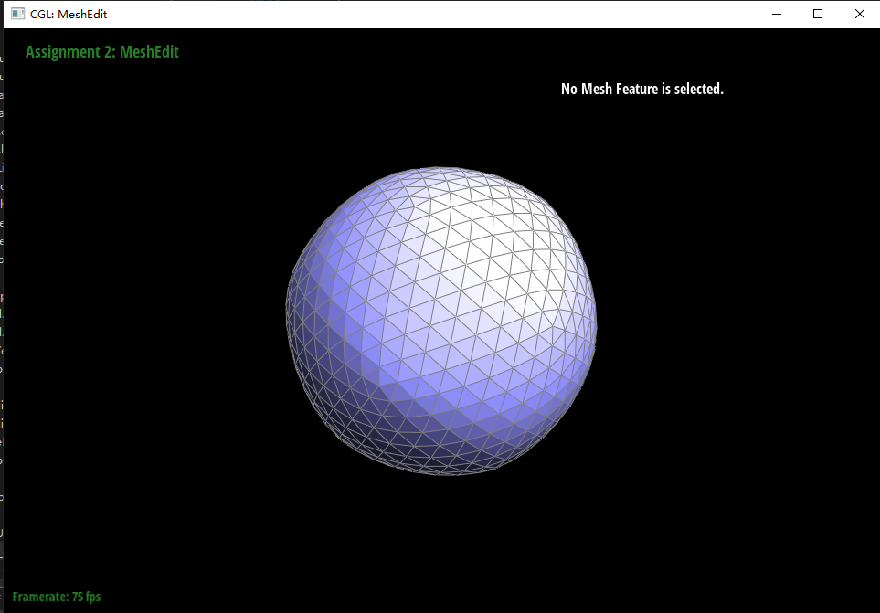|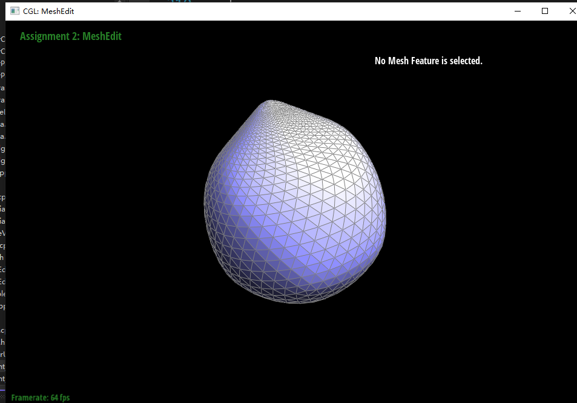||
  
- Load `dae/cube.dae`. Perform several iterations of loop subdivision on the cube. Notice that the cube becomes slightly asymmetric after repeated subdivisions. Can you pre-process the cube with edge flips and splits so that the cube subdivides symmetrically? Document these effects and explain why they occur. Also explain how your pre-processing helps alleviate the effects.  
Because topologically the diagonal is not symmetric, as we subdivide and such topology is used for determining new positions of vertices, over time the overall topology "skews" that way as well.  (original)
     
     
     
Thus if we pre-split and make the overall topology symmetric, we can get a symmetric outcome. (split symmetrically)   
  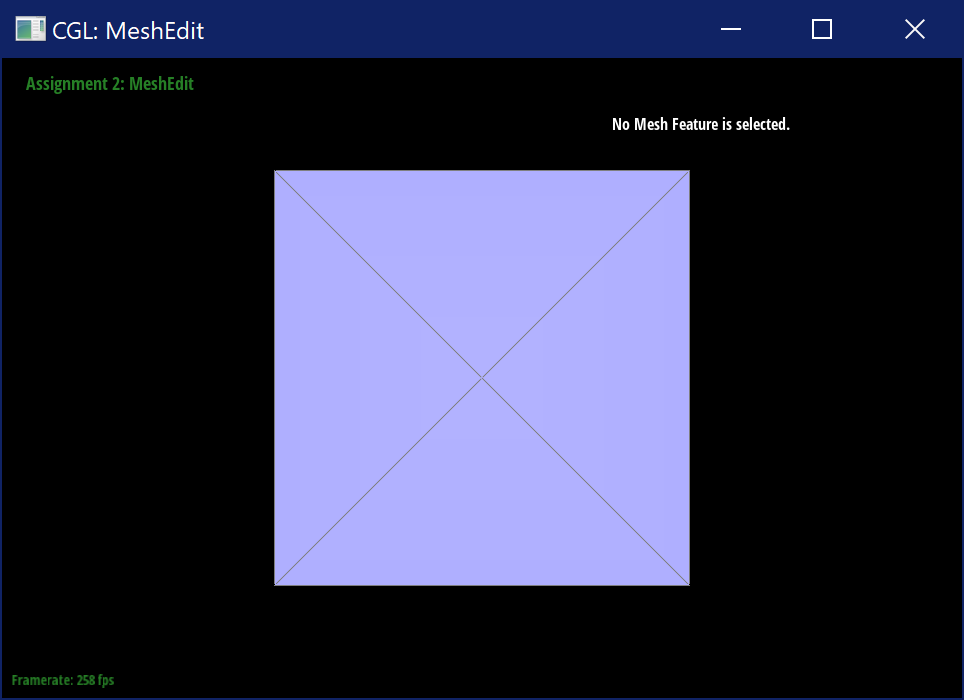   
  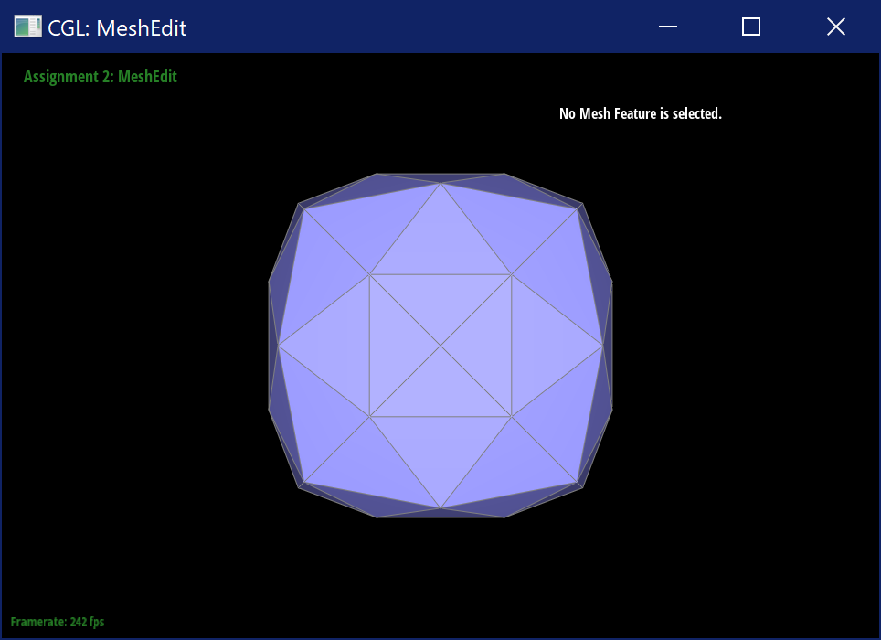   
  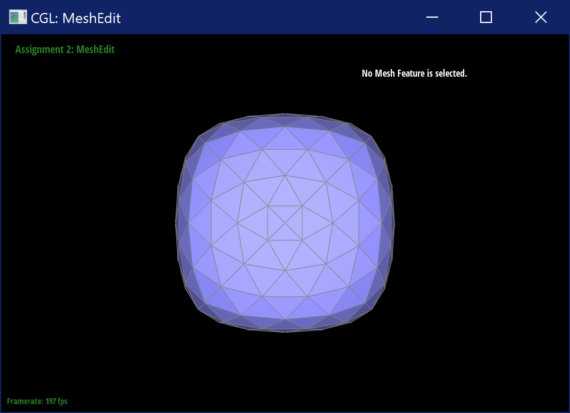   
- If you have implemented any extra credit extensions, explain what you did and document how they work with screenshots.   
I used scheme in [this paper](http://www.geometry.caltech.edu/pubs/WWTDS06.pdf) section 3.1 to calculate new boundary edge positions. Together with T5 EC, this works pretty good imo.
  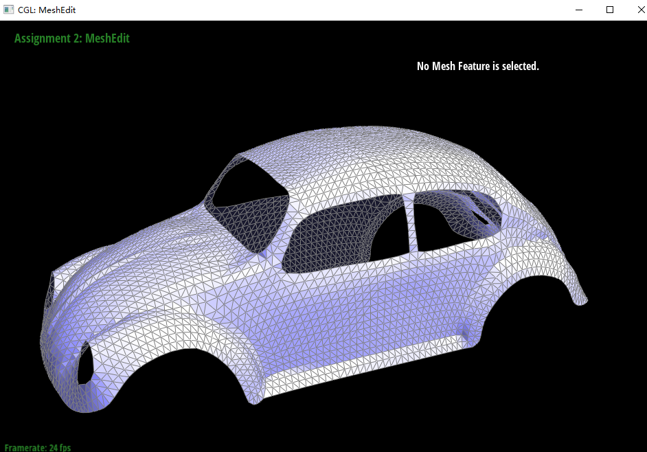   
  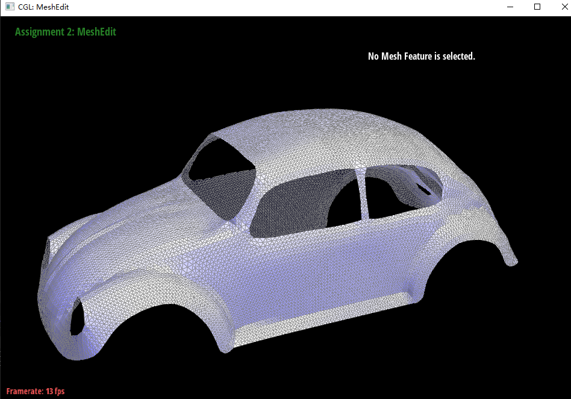 

## Task 7: Design Mesh
Save your best polygon mesh as partsevenmodel.dae in your docs folder and show us a screenshot of the mesh in your write-up.
[upe](images/partsevenmodel.dae)

Include a series of screenshots showing your original mesh and your mesh after one and two rounds of subdivision. If you have used custom shaders, include screenshots of your mesh with those shaders applied as well.
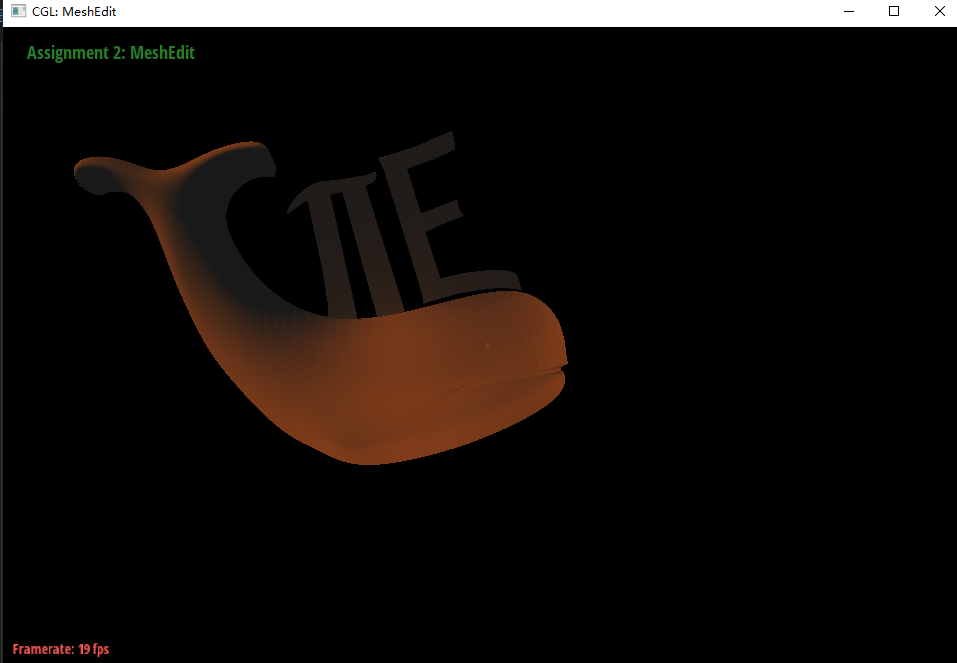  
  
  
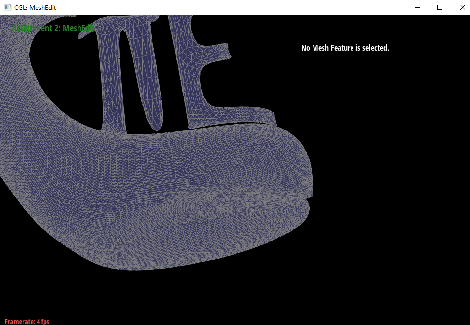  

Describe what you have done to enhance your mesh beyond the simple humanoid mesh described in the tutorial.

I subdivided it with Cinema 4D (this is created a while ago when it was free for students), I also changed camera settings per Piazza so it doesn't screw up.