# Report on CS 184 Project 3: Path Tracer

**IE9 OR ABOVE AND JAVASCRIPT CAPABILITY IS REQUIRED TO SUCCESSFULLY RENDER THIS DOCUMENT**  
**HTML5 IS PREFERABLE BUT NOT REQUIRED**

This site best viewed with Netscape Navigator: 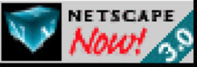

## Overview

This project aims to create core elements of a physical-based path tracing renderer. 

## Part 1: Ray Generation and Scene Intersection

Author: l
### Walk through the ray generation and primitive intersection parts of the rendering pipeline. 
  Firstly we need to convert the given coordinate $(x, y)$ from image space to camera space. The sensor sample has to be on plane $z = -1$, and from linear interpolation we can get $x' = (2x-1) \times tan(\frac{hFov_{rad}}{2}), y' = (2y-1) \times tan(\frac{vFov_{rad}}{2})$. This `dir_cam` vector is then normalized, and converted from camera space to world space using `c2w`. The generated ray starts at camera position (in world space) and has direction `c2w * dir_cam`. Before returning the result, `min_t` and `max_t` is set to `nClip` and `fClip` respectively. <br/>
  For all primitive intersections, all intersections out of range (`[min_t, max_t]`) are ignored, and every valid intersection will shrink upper bound `max_t`. Determining intersection with spheres is based on equation $(o + td - c)^2 = R^2$, and solving it with discriminant ($a = r.d \cdot r.d, b = 2 \times (O_{ray} - O_{sphere}) \cdot r.d, c = (O_{ray} - O_{sphere}) \cdot(O_{ray} - O_{sphere}) - r^2$). If $b^2 - 4ac < 0$, no intersection exists; otherwise intersection(s) can be calculated with $\frac{-b \pm \sqrt{b^2 - 4ac}}{2a}$, and intersection out of $[min_t, max_t]$ range is discarded. As for triangles, Moller Trumbore Algorithm is used to get the barycentric coordinates at the intersection, and derive the normal vector based on $(1 - b1 - b2) * n1 + b1 * n2 + b2 * n3$, filling in provided `Intersection` accordingly. 
### Explain the triangle intersection algorithm you implemented in your own words. 
  With the barycentric coordinate $(b_0, b_1, b_2)$, we substitute sphere boundary with triangle: $O + tD = (1 - b_1 - b_2)P_0 + b_1P_1 + b_2P_2$, thus giving $\begin{bmatrix} -D & P_1 - P_0 & P_2 - P_1 \end{bmatrix} \begin{bmatrix} t \\ b_1 \\ b_2 \end{bmatrix} = O - P_0$. Then we can solve for `t`, `b1` and `b2`. 
### Show images with normal shading for a few small `.dae` files. 


  | 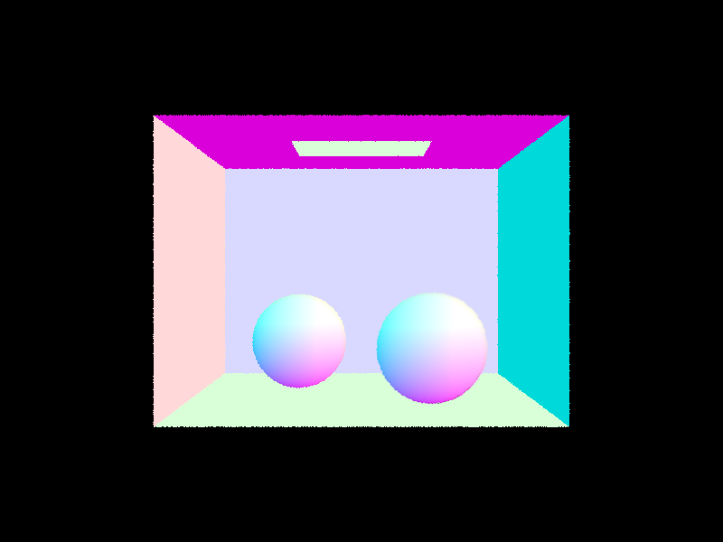 | 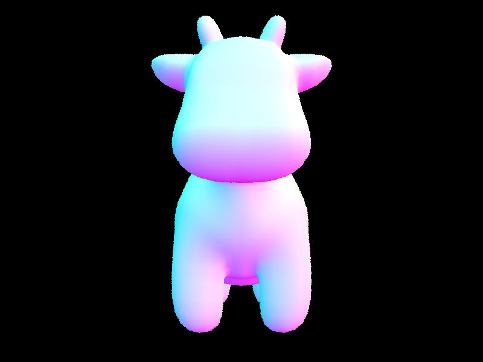 |
  |-----------------------------|------------------------|

## Part 2

Author: x
### Walk through your BVH construction algorithm.
1. I get the minimum and maximum location of centroids of primitives for each axis. With them, I can determine which axis is the longest, and split along that vertex.
2. If the total number of primitives is less than `max_leaf_size`, I create a leaf BVH node, with `node.start` as `start` and `node.end` as `end` as provided in the skeleton code, finally add all primitives to create a bounding box that bounds all of them.
3. If the total number of primitives is more than `max_leaf_size`, I split the elements by finding a "midway" iterator `p` using the simple herustics below. Then I recursively call `construct_bvh` twice, one that contains `start~p`, one that contains `p~end`, to get left and right BVH node. The resulting bounding box should be a bounding box expanded with the bounding boxes of the 2 BVH nodes. I finally set them as the `l` and `r` of the current BVN node and return.

### Show images with normal shading for a few large `.dae` files that you can only render with BVH acceleration.
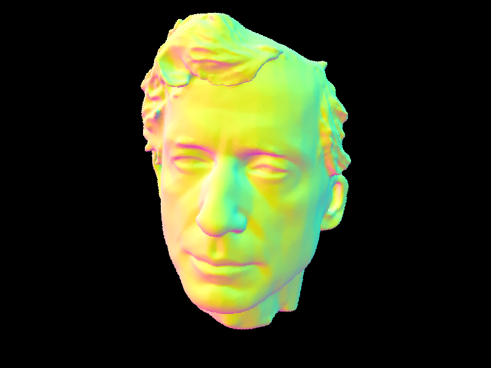  
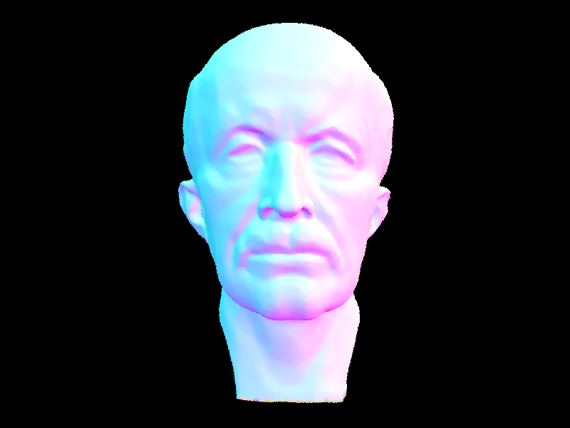  
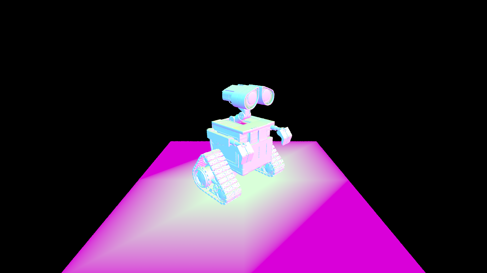


### Explain the heuristic you chose for picking the splitting point.
As described in (1) above I determined the longest axis. When a split is needed I use `std::sort` to sort elements (with the `start` and `end` iterator) by their location on that axis. Then, I pick the pivot `p` such that it is at the middle of the sorted elements; in other words, I split the element evenly by half. While this does not result in fastest intersection test, this may be way to build shallowest BVH tree as it has exactly and at most $\log(n)$ depth.

### Compare rendering times on a few scenes with moderately complex geometries with and without BVH acceleration. Present your results in a one-paragraph analysis.

With BVH Tree and bounding box test, ray tracing speedup on hive is around 1000-3000x compared to old-school ray tracing. This is an extremely notable improvement.

All tests are run with argument `-t 8 -r 800 600` on `hive6.eecs`  with i7-4770 @ 3.7GHz.


| dae File  | With Part 2 | Without Part 2 |
| -------- | -------- | -------- |
|`cow`|0.0806|43.0998|
|`banana`|0.0608|17.9874|
|`maxplanck`|0.1054|382.9254|

For proof, see [](./images/part2/proof)

### EXTRA CREDIT: Implement more efficient construction and intersection routines for the BVH that replace the recursive calls with a stack and a while loop (you should use the C++ standard library's std::stack class). Compare performance in terms of construction time and scene rendering time.
I used `std::stack` while implementing intersection test without thinking this is an possible extra credit oppourtunity, after deoptimising it and optimising construction, intersection time is tested:

Everything is run on Ryzen 3800x @ 3.9HGz with `-t 16 -r 800 600`, windowed mode. 

| File | Construction/Recursion | Intersection/Recursion |Construction/Iteration | Intersection/Iteration |
| -------- | -------- | -------- |-------- | -------- |
| maxplanck     | 0.1020     | 25.3410     |0.1702     | 0.0997     |
| peter     | 0.0719     | 17.1900     |0.1240     | 0.1011     |
| CBlucy     | 0.3024     | 8.5079     |0.5409     | 0.0913     |

See proof [here](./images/part2/proof_ec).  

Using while loop and `std::stack` can drastically increase runtime as 1. there's less OS overhead and 2. we can retain `t0` and `t1` much more easily and use that t0 and t1 when testing intersection for children node. The recursive approach is headless (no t0 and t1 in argument) so it's hard to do it.  
But construction becomes slower. I think the thing is `std::stack` itself might be slower in this situation, also the bounding box construction logic makes it much easier to write in a recursive way (need child bounding box when constructing parent), I wrote lots of extra logic to account for this issue.  
See branch `recursive-bvh` for the recursive version of BVH intersect.

## Part 3: Direct Illumination

Author: l
### Walk through both implementations of the direct lighting function. 
  Hemisphere sampling: After creating the coordinate system based on normal vector of the hit point, generate a random incoming light direction `wj` with `hemisphereSampler->get_sample()`, and create a ray starting from `hit_p` with direction `o2w * wj` (both vectors are in world coordinates), `min_t` setup as `EPS_D`. If this ray intersects with objects in scene, `2 * PI * isect.bsdf->f(w_out, wj) * new_isect.bsdf->get_emission() * dot(wj, isect.n)` is accumulated. Finally, function returns average lighting as result. <br/>
  Importance sampling: For every light source in the scene, first check to determine how many `num_samples` we should use (delta light only needs one, otherwise use `ns_area_light`), and generate a sample with `light->sample_L`. We ignore incoming light with `wj_object.z < 0` (behind the incident surface), and create a new ray as usual. Note that `min_t` and `max_t` need to be set to `EPS_F` and `distToLight - EPS_F` respectively to workaround floating precision issue. Finally, accumulate the average contribution of each light source to result. 
### Show some images rendered with both implementations of the direct lighting function. 


  |          Hemisphere          |         Importance         |
  |------------------------------|----------------------------|
  | 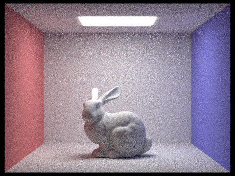   | 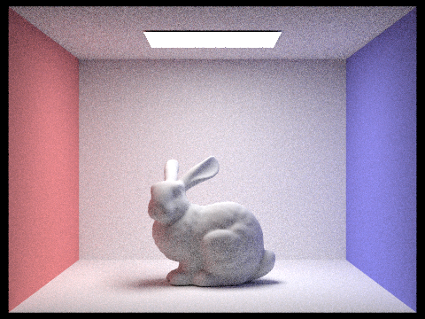   |
  | 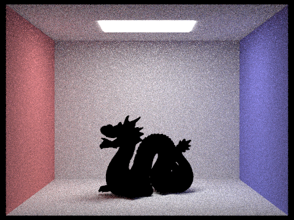  | 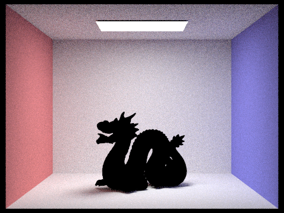  |


### Focus on one particular scene with at least one area light and compare the noise levels in soft shadows when rendering with 1, 4, 16, and 64 light rays (the `-l` flag) and with 1 sample per pixel (the `-s` flag) using light sampling, not uniform hemisphere sampling. 


  |             1 ray             |             4 rays             |             16 rays             |             64 rays             |
  |-------------------------------|--------------------------------|---------------------------------|---------------------------------|
  | 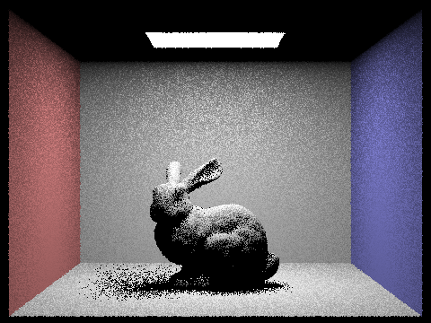  |    |    | 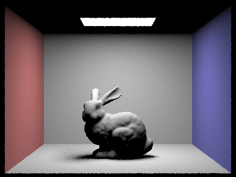   |


- Compare the results between uniform hemisphere sampling and lighting sampling in a one-paragraph analysis. 
  Assuming the same parameters, hemisphere sampling is significantly noisier than importance lighting sampling. 

## Part 4

Author: x
### Walk through your implementation of the indirect lighting function.
In `PathTracer::at_least_one_bounce_radiance()`:
1. Define a probability, $p$, for our Russian Roulette revolver.
2. First, get the one-bounce radiance of the intersection point, and add it to the total radiance, $L_{\text{out}}$.
3. Then, get the bsdf, pdf and the $\omega_{\text{in}}$ with `sample_f`.
4. If the depth of the ray (initialised as $0$) exceeds `max_ray_depth`, return $L_{\text{out}}$.
5. Discharge our revolver for the Russian Roulette: with probability $p$ we continue, with probably $1-p$ we stop and return $L_{\text{out}}$.  However, we get a "free round": if the depth of ray is 0, we always continue.
6. If we are lucky to continue, construct a ray starting at the intersection point shooting towards $\omega_{\text{in}}$, with depth increased and `min_t` set as $\epsilon$.
7. If the ray hit something, then we recursively call `at_least_one_bounce_radiance` with the newly-generated ray and the new intersection point, and get the returned radiance $L$.
8. Calculate the unbiased estimator $X_{\text{rr}}=\frac{Lf(w_i\rightarrow w_o)\cos{\theta}}{p_{\text{rr}}p_{w_{\text{in}}}}$, where $f(w_i\rightarrow w_o)$ is the bsdf we get and $p_{w_{\text{in}}}$ is the pdf we get, and add it to $L_{\text{out}}$.
9. Return $L_{\text{out}}$.

### Show some images rendered with global (direct and indirect) illumination. Use 1024 samples per pixel.
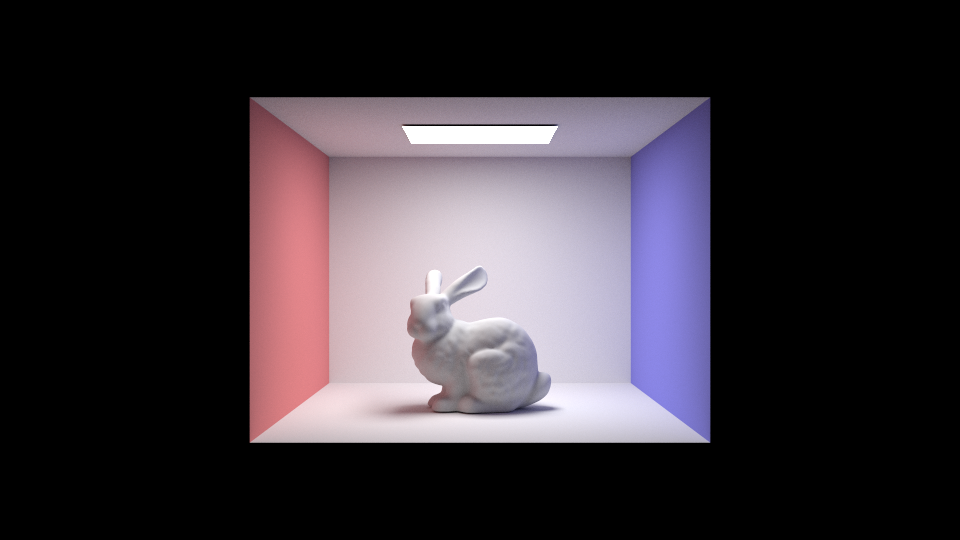  
  
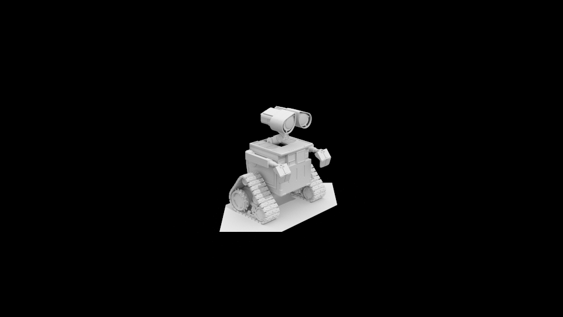

### Pick one scene and compare rendered views first with only direct illumination, then only indirect illumination. Use 1024 samples per pixel. (You will have to edit PathTracer::at_least_one_bounce_radiance(...) in your code to generate these views.)
We edited `PathTracer::at_least_one_bounce_radiance` such that the initial value of `L_out` is `r.depth == 0 ? Vector3D() : one_bounce_radiance(r, isect)` or `r.depth != 0 ? Vector3D() : one_bounce_radiance(r, isect)`. We also need to disable zero-bounce lighting.  

Argument: `./pathtracer -t 15 -r 960 540 -l 16 -m 5 -s 1024
-f CBbunny_t8_s1024_l16_m5_960_540.png ../dae/sky/CBbunny.dae`  
1967.3885s on `hive6.eecs`  with i7-4770 @ 3.7GHz.

| Direct | Indirect |
| -------- | -------- |
| 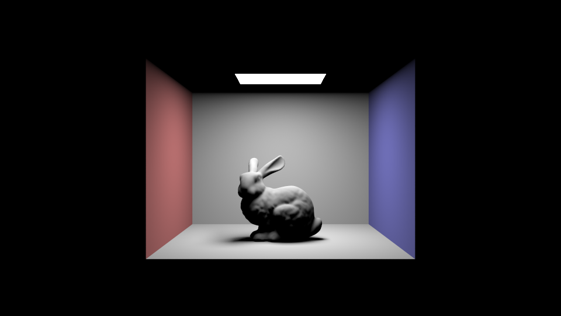 | 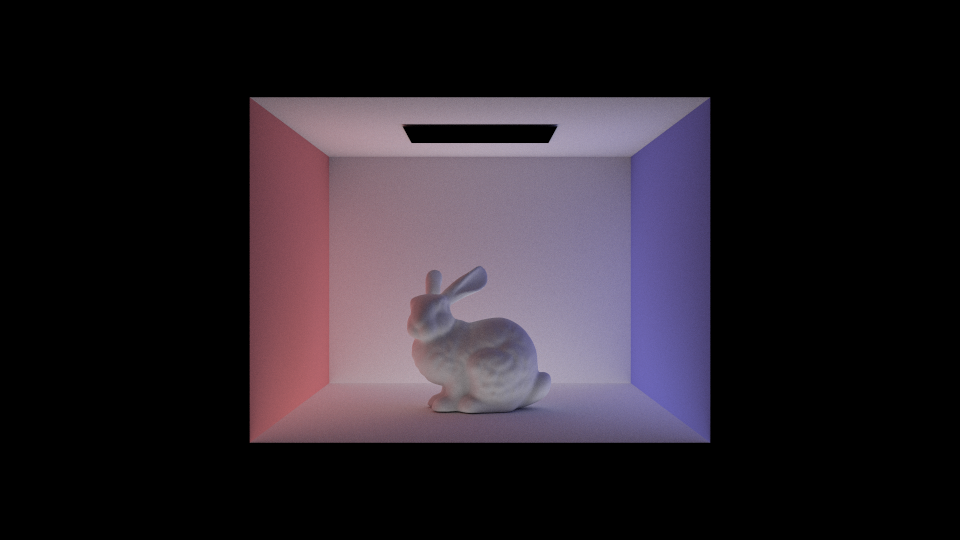 |


### For CBbunny.dae, compare rendered views with max_ray_depth set to 0, 1, 2, 3, and 100 (the -m flag). Use 1024 samples per pixel.


| `max_ray_depth` | Pic | Argument |
| -------- | -------- | -------- |
| 0     | 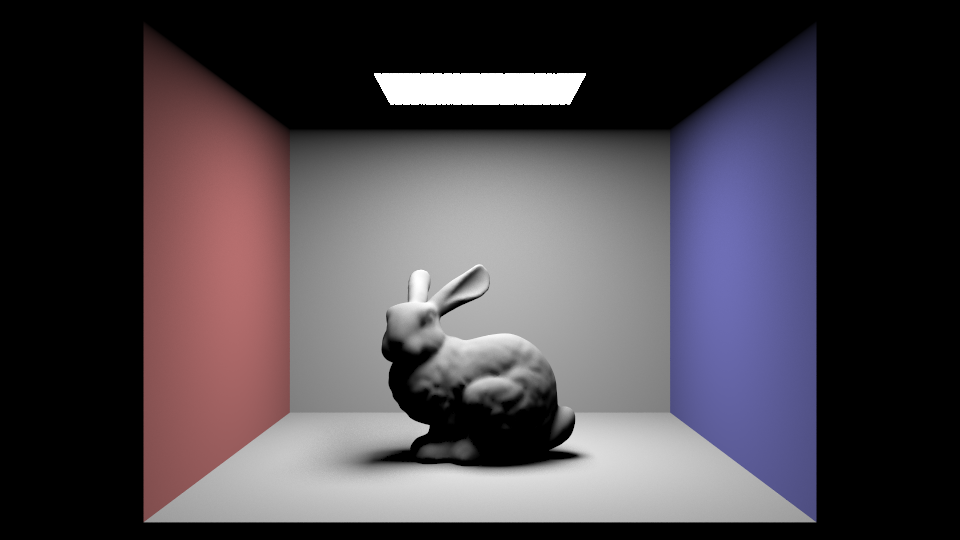      | `./pathtracer -t 8 -s 1024 -l 16 -m 0 -r 960 540 -f ./out-part4-2/CBbunny_t8_s1024_l16_m0_960_540.png ../dae/sky/CBbunny.dae`     |
| 1     | 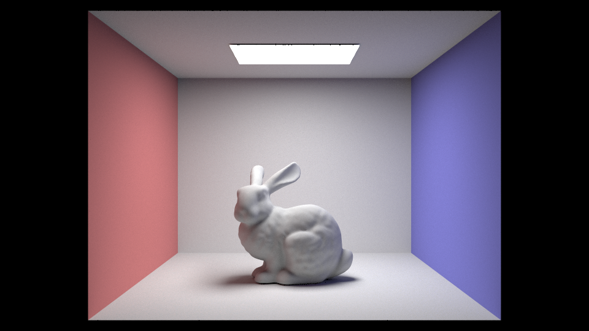     | `./pathtracer -t 8 -s 1024 -l 16 -m 1 -r 960 540 -f ./out-part4-2/CBbunny_t8_s1024_l16_m0_960_540.png ../dae/sky/CBbunny.dae`     |
| 2     | 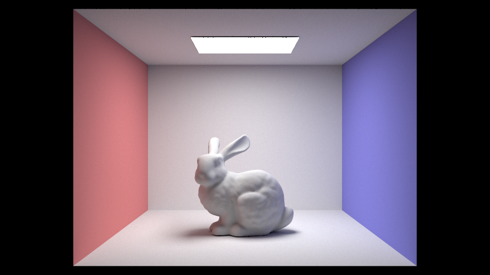     | `./pathtracer -t 8 -s 1024 -l 16 -m 2 -r 960 540 -f ./out-part4-2/CBbunny_t8_s1024_l16_m0_960_540.png ../dae/sky/CBbunny.dae`     |
| 3     | 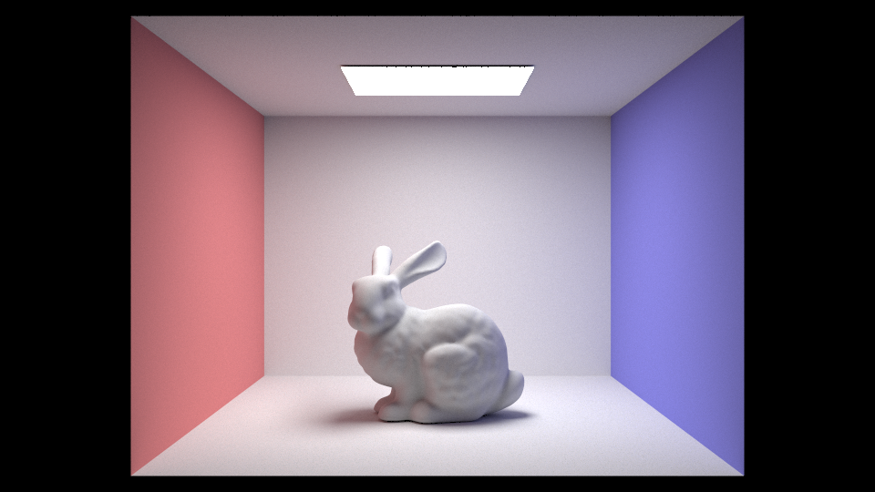     | `./pathtracer -t 8 -s 1024 -l 16 -m 3 -r 960 540 -f ./out-part4-2/CBbunny_t8_s1024_l16_m0_960_540.png ../dae/sky/CBbunny.dae`     |
| 100     | 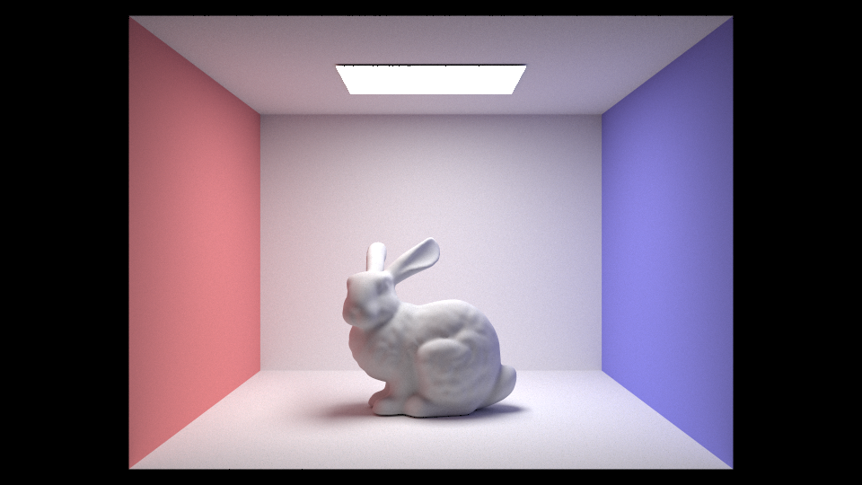     | `./pathtracer -t 8 -s 1024 -l 16 -m 100 -r 960 540 -f ./out-part4-2/CBbunny_t8_s1024_l16_m0_960_540.png ../dae/sky/CBbunny.dae`     |


### Pick one scene and compare rendered views with various sample-per-pixel rates, including at least 1, 2, 4, 8, 16, 64, and 1024. Use 4 light rays.

We used this simple script to overload hive for one whole night:
```bash
./pathtracer -t 8 -s 1 -l 4 -m 5 -r 960 540 -f ./out-part4-1/CBspheres_t8_s1_l4_m5_960_540.png ../dae/sky/CBspheres_lambertian.dae &
./pathtracer -t 8 -s 2 -l 4 -m 5 -r 960 540 -f ./out-part4-1/CBspheres_t8_s2_l4_m5_960_540.png ../dae/sky/CBspheres_lambertian.dae &
./pathtracer -t 8 -s 4 -l 4 -m 5 -r 960 540 -f ./out-part4-1/CBspheres_t8_s4_l4_m5_960_540.png ../dae/sky/CBspheres_lambertian.dae &
./pathtracer -t 8 -s 8 -l 4 -m 5 -r 960 540 -f ./out-part4-1/CBspheres_t8_s8_l4_m5_960_540.png ../dae/sky/CBspheres_lambertian.dae &
./pathtracer -t 8 -s 16 -l 4 -m 5 -r 960 540 -f ./out-part4-1/CBspheres_t8_s16_l4_m5_960_540.png ../dae/sky/CBspheres_lambertian.dae &
./pathtracer -t 8 -s 64 -l 4 -m 5 -r 960 540 -f ./out-part4-1/CBspheres_t8_s64_l4_m5_960_540.png ../dae/sky/CBspheres_lambertian.dae &
./pathtracer -t 8 -s 1024 -l 4 -m 5 -r 960 540 -f ./out-part4-1/CBspheres_t8_s1024_l4_m5_960_540.png ../dae/sky/CBspheres_lambertian.dae &
```

| `sample_per_pixel` | Pic |
| -------- | -------- | 
| 1     | 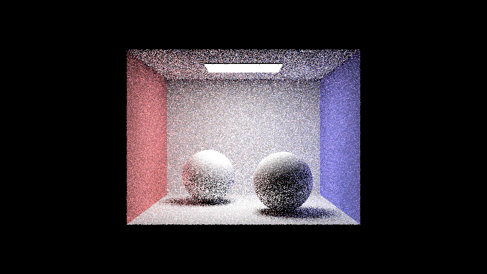 |
| 2     | 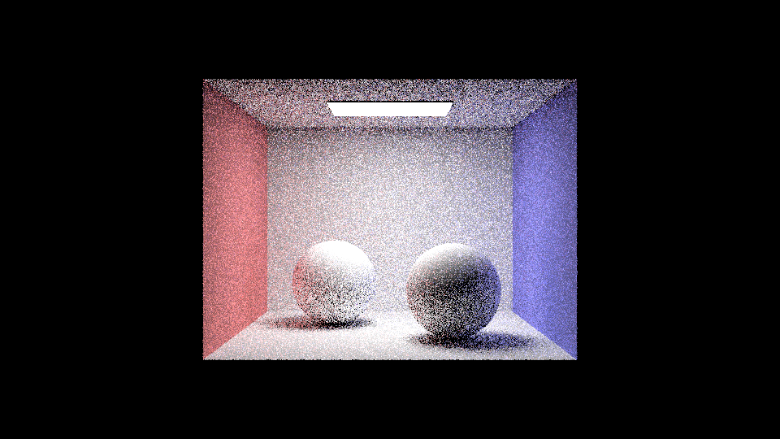 |
| 4     | 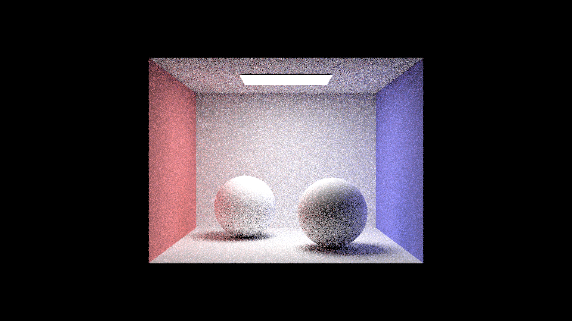 |
| 8     |  |
| 16     |  |
| 64     | 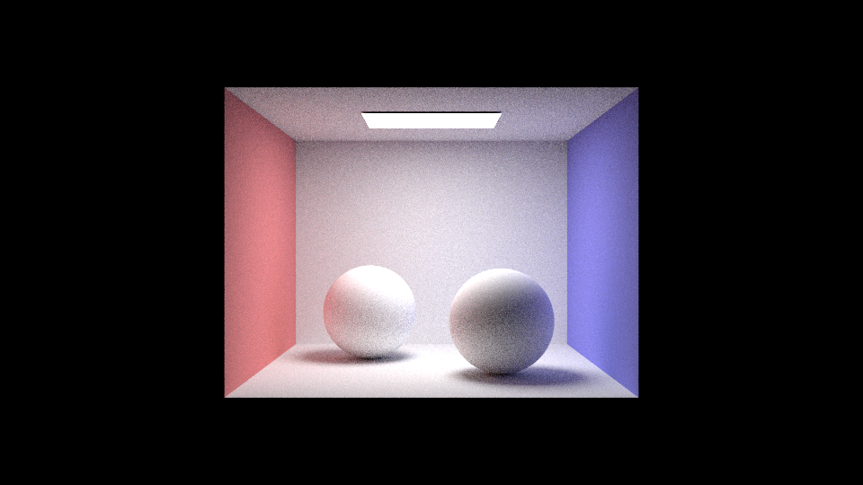 |
| 1024     |  |

## Part 5: Adaptive Sampling

Author: l

### Walk through your implementation of the adaptive sampling. 
  In the `PathTracer::raytrace_pixel` loop, use `s1` and `s2` to trace the accumulative sum of illuminance and illuminance^2 at present. Before every `samplesPerBatch` execution of loop body, check if currently $1.96 \times \frac{\sigma}{\sqrt{n}} <= maxTolerance \times mean$. If this condition is satisfied, stop sampling and store current average, sampling count to sample buffer, sample count buffer. 
### Pick one scene and render it with at least 2048 samples per pixel. Show a good sampling rate image with clearly visible differences in sampling rate over various regions and pixels. Include both your sample rate image, which shows your how your adaptive sampling changes depending on which part of the image you are rendering, and your noise-free rendered result. Use 1 sample per light and at least 5 for max ray depth. 

CLI: `./pathtracer -t 8 -s 2048 -l 1 -m 6 -a 256 0.05 -r 1920 1080 -f niubi1.png ../dae/keenan/building.dae`


  |           Result           |       Sample Distribution       |
  |----------------------------|---------------------------------|
  | 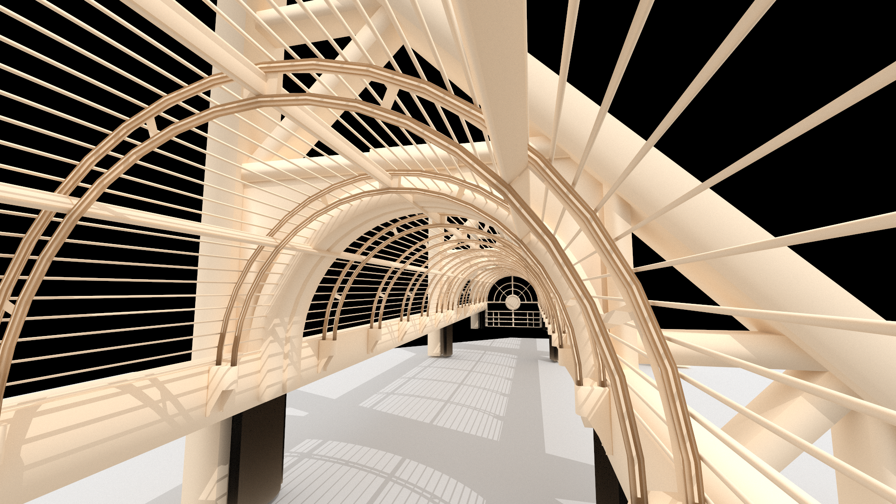  | 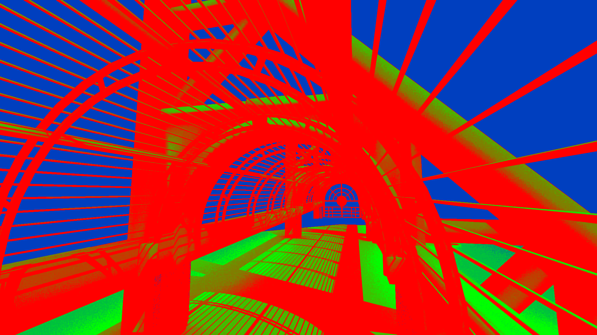  |
  
`hive` must be very tired for this picture......  


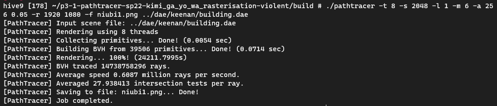

### Potential EC???

author: x

We investigated how `pathtracer` parse camera in `dae` file. It appears that for some cameras (that has certain transformation, like in `building.dae` - the camera, as in blender, is inside the tunnel, but when opening in `pathtracer` it's above) it cannot be parsed correctly - potentially because of some transformations it made in `collada.cpp:175-199`. We investigated how `pathtracer` parse XML, specifically in `collada.cpp:255-268` (how does it apply transformation to camera) and `collada.cpp:358-397` (how it parsess camera), and how camera is used in the actual rendering, specifically `application.cpp:246-251` and `application.cpp:284-296`.   
We need to solve this because we need to run rendering for `building.dae` on hive in order to save our electricity, but `hive*`'s nVidia driver has certain bugs that prevents OpenGL from running on a forwarded headless X server, so we must be able to transform the camera without the GUI. 

Sadly we cannot fix the issue in one day, so we decided to use an violent approach (in branch `violent`): we dump out the camera setting and forcibly write it in. Then we discovered the `-c` flag so this is useless. 

We encountered the same issue when rendering `1920*1080`: we need to scale about 2.5x in order to get a real high resolution image. Thus, we added a flag `-k` such that it moves the camera up with argument `2.5f`. This makes our life easier before discovering `-c` flag, and we don't need to deal with camera settings at all even if we knew it.