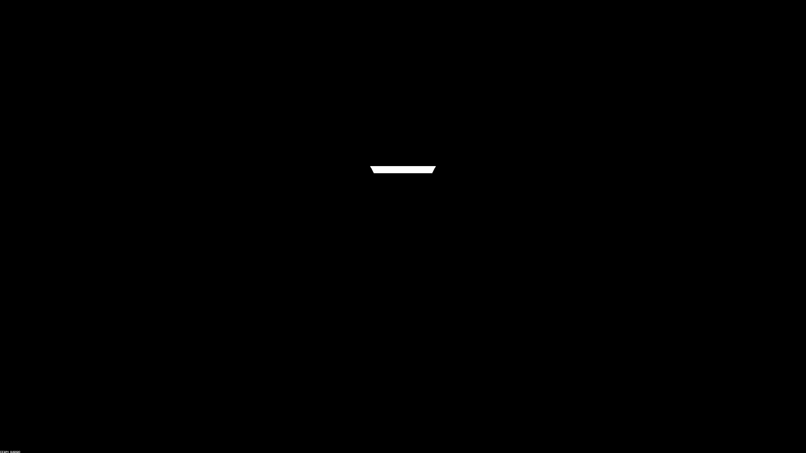
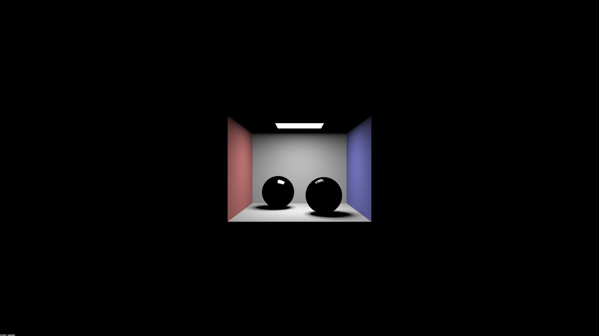
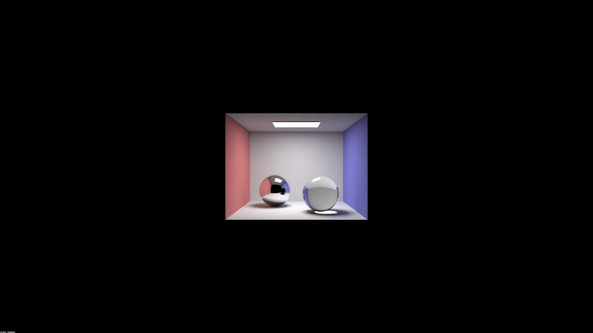
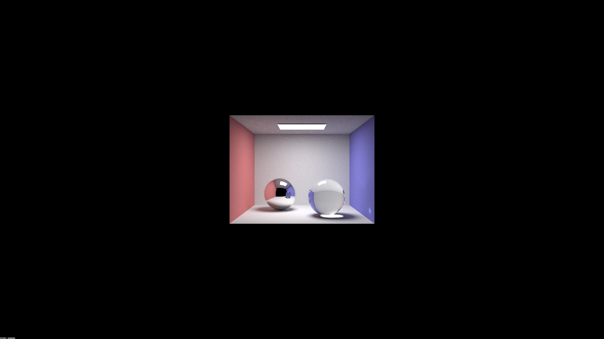
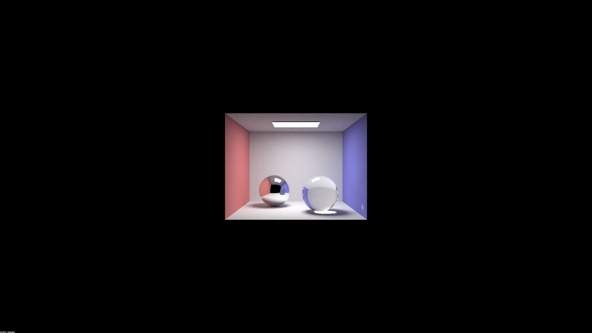
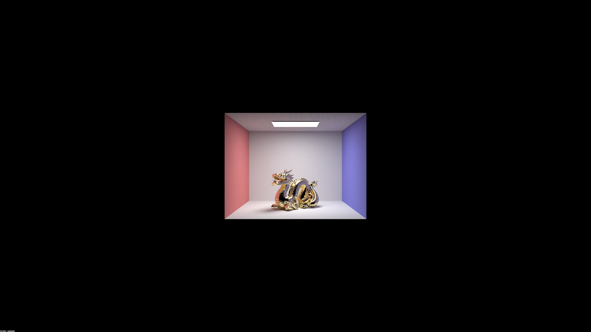
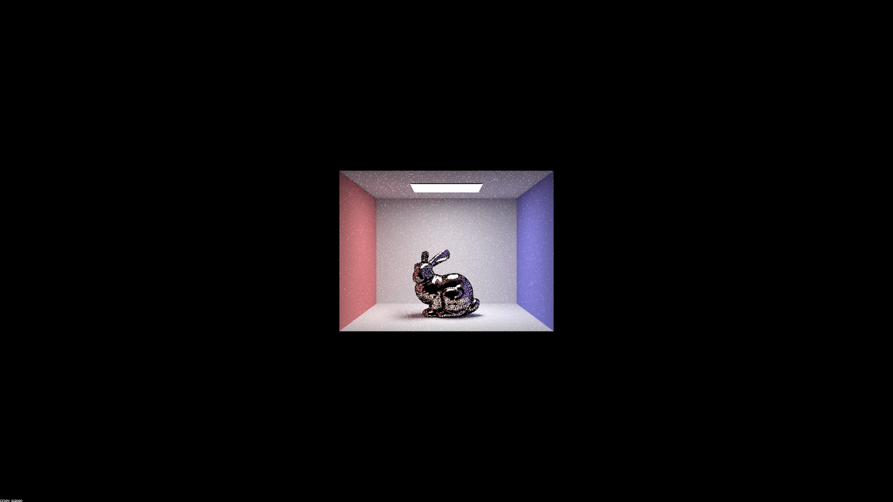
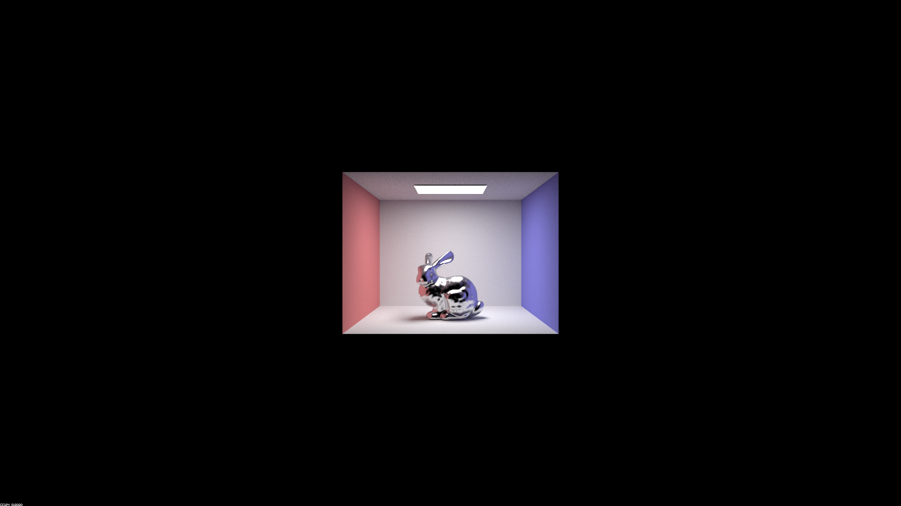

# Report on CS 184 Project 3: Path Tracer, take two

## Overview

This project implements additional features on the basis of previous project p3-1: pathtracer. For the project requirement, we implemented part 1 and part 2.

## Part 1: Mirror and Glass Materials

- Show a sequence of six images of scene `CBspheres.dae` rendered with `max_ray_depth` set to 0, 1, 2, 3, 4, 5, and 100. The other settings should be at least 64 samples per pixel and 4 samples per light.  
  Using `-s 256 -l 16 -r 1920 1080`: </br>
  | `max_ray_depth` |              Result              |
  |-----------------|----------------------------------|
  |        0        |    |
  |        1        |    |
  |        2        |    |
  |        3        |    |
  |        4        |    |
  |        5        |    |
  |       100       |  |

- Point out the new multibounce effects that appear in each image. Explain how these bounce numbers relate to the particular effects that appear.  
  We can see a progressive change with the rising `max_ray_depth`: at 0 bounce, we can only see the direct light from light source; at 1 bounce, we can additionally see all direct reflection from all surfaces and highlights on spheres; at 2 bounces, secondary reflection of its surrounding begins to appear on the metallic sphere, and the glass sphere starts to reflect light (however, refract light doesn't escape the sphere, so the sphere is significantly dimmer), also the ceiling is now lit; at 3 bounces, the glass sphere becomes more transparent and now has proper refraction effects, and we can see the refracted light in its shadow; at 4 bounces, the glass sphere clears up more, and a projection of rays appears on the blue wall (rays get reflected from metallic sphere into the glass sphere, and refracted towards the wall), also note that the glass sphere reflection on the metallic sphere starts clearing up as well (with 1 depth delay); 5 bounces and 100 bounces only provides slight visual quality improvements comparing with previous images.  

## Part 2: Microfacet Material

- Show a sequence of 4 images of scene `CBdragon_microfacet_au.dae` rendered with α set to 0.005, 0.05, 0.25 and 0.5. The other settings should be at least 128 samples per pixel and 1 samples per light. The number of bounces should be at least 5. Describe the differences between different images. Note that, to change the α, just open the .dae file and search for `microfacet`.  
  Using `-s 512 -l 8 -m 8 -r 1920 1080`: </br>
  |   α   |                Result                |
  |-------|--------------------------------------|
  | 0.005 |   |
  |  0.05 |    |
  |  0.25 |    |
  |   0.5 |     |</br>

  As we can see in the images shown above, with higher α values, the material becomes less reflective and diffuses more.  

- Show two images of scene `CBbunny_microfacet_cu.dae` rendered using cosine hemisphere sampling (default) and your importance sampling. The sampling rate should be fixed at 64 samples per pixel and 1 samples per light. The number of bounces should be at least 5. Briefly discuss their difference.  
  |    Cosine Hemisphere Sampling    |         Importance Sampling         |
  |----------------------------------|-------------------------------------|
  |   |  |</br>

  As we can see, the importance sampling result is significantly less noisy, because the default hemisphere sampling has a higher chance to sample a direction with a low density of microfacets.  

- Show at least one image with some other conductor material, replacing `eta` and `k`. Note that you should look up values for real data rather than modifying them arbitrarily. Tell us what kind of material your parameters correspond to.  
  A mercury bunny: </br>
   </br>
  Using parameters: </br>

  ```xml
  <alpha>0.1</alpha>
  <eta>1.8795 1.5472 1.1353</eta>
  <k>5.1076 4.6437 3.9980</k>
  ```

## Part 3: Environment Light (if implemented) - pick one exr

- In a few sentences, explain the ideas behind environment lighting (i.e. why we do it/how it works).  
  <text>

- Show the `probability_debug.png` file for the .exr file you are using, generated using the `save_probability_debug()` helper function after initializing your probability distributions.  
  <text>

- Use the `bunny_unlit.dae` scene and your environment map .exr file and render two pictures, one with uniform sampling and one with importance sampling. Use 4 samples per pixel and 64 samples per light in each. Compare noise levels.  
  <text>

- Use a different image (if you did part 2, we recommend `bunny_microfacet_cu_unlit.dae`) and your environment map .exr file and render two pictures, one with uniform sampling and one with importance sampling. Use 4 samples per pixel and 64 samples per light in each. Compare noise levels.  
  <text>

## Part 4: Depth of Field (if implemented)

- In a few sentences, explain the differences between a pinhole camera model and a thin-lens camera model.  
  <text>

- Show a "focus stack" where you focus at 4 visibly different depths through a scene.  
  <text>

- Show a sequence of 4 pictures with visibly different aperture sizes, all focused at the same point in a scene.  
  <text>
